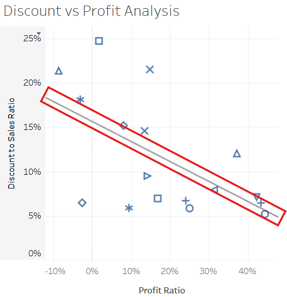

# Sales Performance Optimization: Analyzing Regional and Category-Level Profitability in Superstore Data

This data visualisation project examines the Superstore dataset to identify performance gaps and profitability trends across U.S. regions, product categories, and customer behaviours. Using Tableau, we analyse how factors such as discount rates, shipping modes, and product subcategories impact sales and profit margins. The goal is to provide actionable insights that help optimise pricing strategies, inventory focus, and operational efficiency.

🔗 [View the Interactive Tableau Dashboard](https://public.tableau.com/views/SalesPerformanceOptimizationAnalyzingRegionalandCategory-LevelProfitabilityinSuperstoreData/ExecutiveOverview?:language=en-US&:sid=&:redirect=auth&:display_count=n&:origin=viz_share_link)

---

## 📈 Dashboard Insights with Visual Evidence

### 1. Regional Performance

- **California and Texas** generate high sales but also show losses in certain furniture sub-categories.
- **South and Central regions** have lower average profits, signaling a need for targeted improvement.

---

### 2. Product Category Analysis

- **Technology** consistently yields high profit-to-sales ratios.
- **Furniture**, especially **Tables** and **Bookcases**, often results in negative profits.

---

### 3. Discount Impact

- Discounts above **20%** are strongly correlated with profit losses.
- Aggressive discounting appears to drive sales but hurt the bottom line.

---

### 4. Shipping Mode Performance

- **Standard Class** is the most used but often correlates with lower customer satisfaction and increased return rates.
- **Same Day** shipments show high cost but are preferred for high-value items.

---
